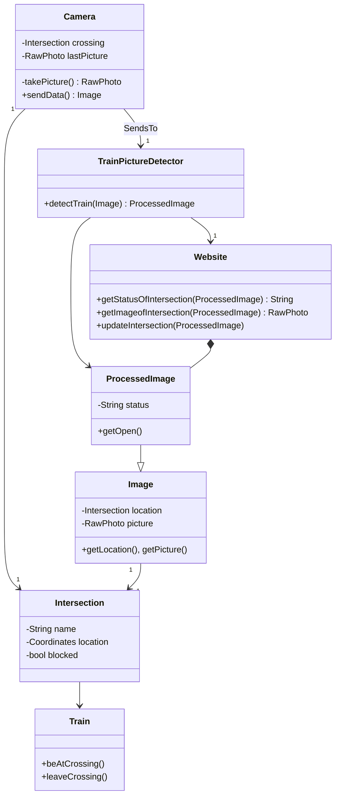

# Domain Model

```mermaid
classDiagram
  class Train
    Train : +beAtCrossing()
    Train : +leaveCrossing()
  Intersection --> Train
  class Intersection
    Intersection : -String name
    Intersection : -Coordinates location
    Intersection : -bool blocked
  class Camera
    Camera : -Intersection crossing
    Camera : -RawPhoto lastPicture
    Camera : -takePicture() RawPhoto
    Camera : +sendData() Image
  Camera "1" --> "1" Intersection
  Camera --> "1" TrainPictureDetector : SendsTo
  class Image
    Image : -Intersection location
    Image : -RawPhoto picture
    Image : +getLocation(), getPicture()
  Image "1" --> "1" Intersection
  class TrainPictureDetector
    TrainPictureDetector : +detectTrain(Image) ProcessedImage
  TrainPictureDetector --> "1" Website
  TrainPictureDetector --> ProcessedImage
  class ProcessedImage
    ProcessedImage: -String status
    ProcessedImage: +getOpen()
  ProcessedImage --|> Image
  class Website
    Website : +getStatusOfIntersection(ProcessedImage) String
    Website : +getImageofIntersection(ProcessedImage) RawPhoto
    Website : +updateIntersection(ProcessedImage)
  Website *-- ProcessedImage
 
  
```
