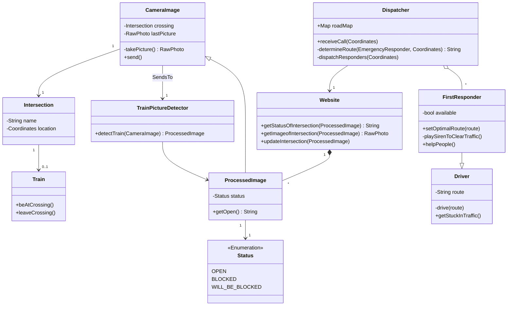

# Domain Model

## Definitions
### Dispatcher
A dispatcher, specifically an emergency dispatcher, is a person who receives calls and information, and sends the appropriate services to help. They are located in a stationary place, and have multiple montitors and systems to use. They are experts in relaying information. They are the main users of the software.

### First Responders
A first responder is a person who goes to the scene of an incident to provide assistence. They include firefighters, police, EMTs, and paramedics. A first responder is in a vehicle, and is told where to help by a dispatcher. They often have a screen inside their vehicle that helps guide them to the location. 

### Intersection
Here, an intersection refers to where a train track and a road meet, also called a crossing. Intersections have lights that go off when a train is passing through. Some intersections have guards that lower when the lights go off, preventing cars from getting on the track.

### Train
A train is a vehicle that is strictly limited to running on train tracks. Tracks are arranged into classes, each with different speed limits. The lowest is 10-15mph, and the highest (and most common) is 60-80mph. [Source.](https://www.trains.com/trn/train-basics/abcs-of-railroading/track-classifications/)  According to [a study](https://www.aar.org/issue/freight-train-length/#!) in 2023, the median length of train cars in the slowest class was 5,300 feet.
