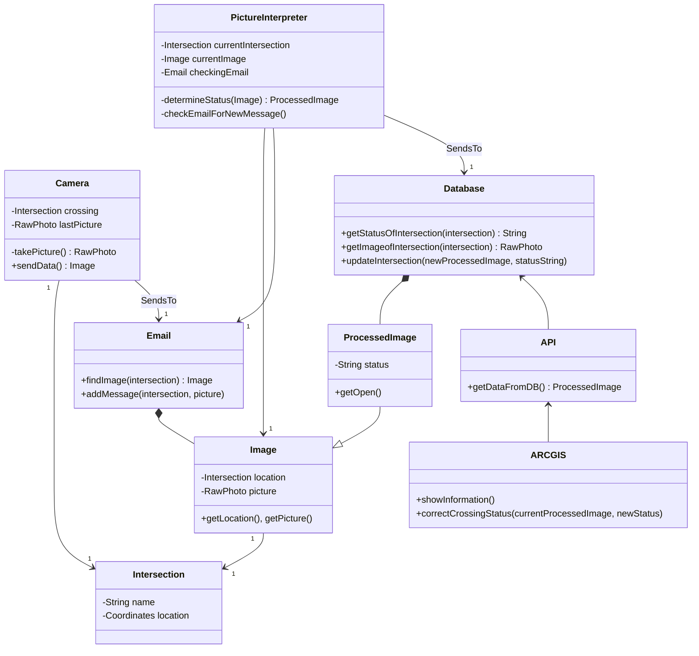

# Domain Model

```mermaid
classDiagram
  class Intersection
    Intersection : -String name
    Intersection : -Coordinates location
  class Camera
    Camera : -Intersection crossing
    Camera : -RawPhoto lastPicture
    Camera : -takePicture() RawPhoto
    Camera : +sendData() Image
  Camera "1" --> "1" Intersection
  Camera --> "1" Email : SendsTo
  class Image
    Image : -Intersection location
    Image : -RawPhoto picture
    Image : +getLocation(), getPicture()
  Image "1" --> "1" Intersection
  class Email
    Email : +findImage(intersection) Image
    Email : +addMessage(intersection, picture)
  Email *-- Image
  class PictureInterpreter
    PictureInterpreter : -Intersection currentIntersection
    PictureInterpreter : -Image currentImage
    PictureInterpreter : -Email checkingEmail
    PictureInterpreter : -determineStatus(Image) ProcessedImage
    PictureInterpreter : -checkEmailForNewMessage()
  PictureInterpreter --> "1" Image
  PictureInterpreter --> "1" Email
  PictureInterpreter --> "1" Database : SendsTo
  class ProcessedImage
    ProcessedImage: -String status
    ProcessedImage: +getOpen()
  ProcessedImage --|> Image
  class Database
    Database : +getStatusOfIntersection(intersection) String
    Database : +getImageofIntersection(intersection) RawPhoto
    Database : +updateIntersection(newProcessedImage, statusString)
  Database *-- ProcessedImage
  Class API
    API : +getDataFromDB() ProcessedImage
  Database <-- API
  Class ARCGIS
    ARCGIS : +showInformation()
    ARCGIS : +correctCrossingStatus(currentProcessedImage, newStatus)
  API <-- ARCGIS
  
```
