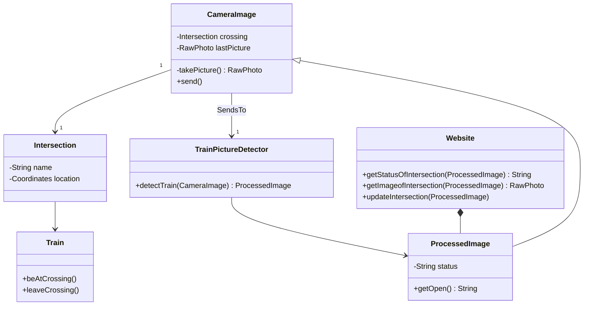

# Domain Model

```mermaid
classDiagram
  class Train
    Train : +beAtCrossing()
    Train : +leaveCrossing()
  Intersection --> Train
  class Intersection
    Intersection : -String name
    Intersection : -Coordinates location
  class CameraImage
    CameraImage : -Intersection crossing
    CameraImage : -RawPhoto lastPicture
    CameraImage : -takePicture() RawPhoto
    CameraImage : +send()
  CameraImage "1" --> "1" Intersection
  CameraImage --> "1" TrainPictureDetector : SendsTo
  class TrainPictureDetector
    TrainPictureDetector : +detectTrain(CameraImage) ProcessedImage
  TrainPictureDetector --> ProcessedImage
  class ProcessedImage
    ProcessedImage: -String status
    ProcessedImage: +getOpen() String
  ProcessedImage --|> CameraImage
  class Website
    Website : +getStatusOfIntersection(ProcessedImage) String
    Website : +getImageofIntersection(ProcessedImage) RawPhoto
    Website : +updateIntersection(ProcessedImage)
  Website *-- ProcessedImage
 
  
```
