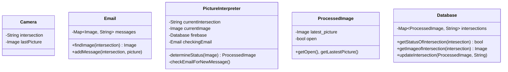

# Domain Model

```mermaid
classDiagram
  class Camera
    Camera : -String intersection
    Camera : -Image lastPicture
  class Email
    Email : -Map~Image, String~ messages
    Email : +findImage(intersection) Image
    Email : +addMessage(intersection, picture)
  class PictureInterpreter
    PictureInterpreter : -String currentIntersection
    PictureInterpreter : -Image currentImage
    PictureInterpreter : -Database firebase
    PictureInterpreter : -Email checkingEmail
    PictureInterpreter : -determineStatus(Image) ProcessedImage
    PictureInterpreter : -checkEmailForNewMessage()
  class ProcessedImage
    ProcessedImage: -Image latest_picture
    ProcessedImage: -bool open
    ProcessedImage: +getOpen(), getLastestPicture()
  class Database
    Database : -Map~ProcessedImage, String~ intersections
    Database : +getStatusOfIntersection(intesection) bool
    Database : +getImageofIntersection(intersection) Image
    Database : +updateIntersection(ProcessedImage, String)

```
