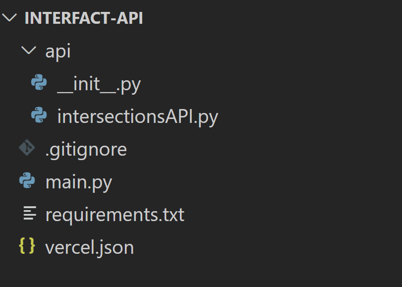

# Technology Stack: 

  • Internet connected camera hardware - Sends image data periodically to interfact.camera@gmail.com
  
  • StatusChecker Python program - Processes image data for presance of trains
  
  • SQL Database - Stores the status of the intersection & archives for future predictive features
  
  • Firebase - Stores the latest state for each intersection for system access
  
  • Angular - Front-end development
  
  • ArcGIS - Plugin to overlay status on a map

# Replicating Development Environment: 

## Manually:
1. Download [Anaconda](https://www.anaconda.com/download/success) with python version 3.12
2. Install Anaconda; the default values are fine.
3. Open Anaconda Prompt
4. In prompt:
   * `conda create --name interfact python=3.13.0`
     * If you make something incorrectly, the command `conda remove -n [name] --all` will let you begin again
   *  type y to proceed
   * `conda activate interfact`
   * install packages using:
      * pip install Flask==3.0.3
      * pip install firebase-admin==6.5.0
      * pip install python-dotenv==1.0.1
      * pip install google-cloud-firestore==2.19.0
    * once done, type `pip list` to verify these are installed
5. In a terminal, clone the project with `git clone https://github.com/Ethan-Chester/Interfact-API.git`
6. Download VisualStudio Code, and install it per their instructions
7. Open VSCode and open the Interfact-API project
8. In the extensions tab on the left (looks like multiple blocks), download the Python
v2024.16.1 extension by Microsoft.
9. Return to the main tab, and press ctrl+shift+p (or cmd+shift+p for mac). In the tab select Python: Select Intrepreter. Then, select the Python 3.13.0 ('interfact') option.
10. In the api folder of the project, create a new file called `.env`
    * Inside the .env file write `firebase_api_key=''`
    * On another line, write `flask_secret_keys=''`
    * This is sensitive information that will be assigned to you later. 
11. Once you receive the keys, and the `.env` file is saved, you may run the API locally by running `main.py`.
    * Go to the link [`http://127.0.0.1:5000/api/intersections/geo-json`](http://127.0.0.1:5000/api/intersections/geo-json) to confirm that the build is producing geo-json properly.
    * Once you are finished using the server, return to the terminal in VSCode and press `ctrl+c` to safely close the server.

## Via Docker
1. Follow instructions 5 through 10 of Manual installation (clone repo, set up VSCode for work, and get keys)
2. Download [Docker Desktop](https://www.docker.com/products/docker-desktop/) for your OS
3. Install per their directions. It may require restarting your computer
    * There is no need to open the docker desktop app. If it opens, you may close it.
    * If you do choose to use it in some scenarios, simply skip the initial questions it asks you.
    * Additionally, the Docker Desktop apps takes a while to open. Have patience.
4. Open VSCode. In the extensions tab on the left, which looks like multiple squares, find the Docker extension, v 1.29.3 created by Microsoft, and download it.
5. In the terminal in VSCode, enter the command `docker build -t interfact-image .`
    * This creates a new image of the name "interfact-image"
    * Be sure to include the period at the end
    * Be sure that Docker Desktop is open when running this command
    * The initial build will be slow, but it will speed up after the first time
6. To run the project, enter the command `docker run -d -p 5000:5000 interfact-image`
    * Without using -d -p, the container will not run in your browser.
    * If it asks for Docker Backend to access your computer, allow it.
7. Check that the build is running by going to [`localhost:5000/api/intersections/geo-json`](localhost:5000/api/intersections/geo-json)
8. To stop the build, enter `docker ps` to find all containers and their IDs. Find the one you were just running, and enter `docker stop [containerID]`
    * It takes a moment for a container to stop.
    * Alternatively, you may stop a container in the Docker Desktop app, simply by navigating to the containers tab, finding the running container, and hitting the stop button.
9. If you make changes to the project and would like to see them, repeat steps 5-8.

### Troubleshooting Docker
If you are having trouble building a container, that means there is an error with the image. The terminal does not give any kind of error message, but the Docker Desktop will give you error messages if you try to run the image there.
If Docker Desktop is not opening, try closing VSCode, opening Task Manager, and ending all Docker tasks, including Docker Backend, before trying to open the app again.

# File & Folder Structure: 

  

This is the file structure for the Interfact API. init.py and intersection.py both constitute the API files, which are called in main.py.

In a separate repository, a documentation file structure is implemented. Main runnable project files will be located in the Auxiliary Files folder, layout & design files are located in the Design folder, client meeting details are located in the Discovery folder, the Meeting Minutes folder contains team meeting dates and details, the Documentation folder contains the development and deployment files, and the Presentations folder contains files related to Interfact team presentations.
