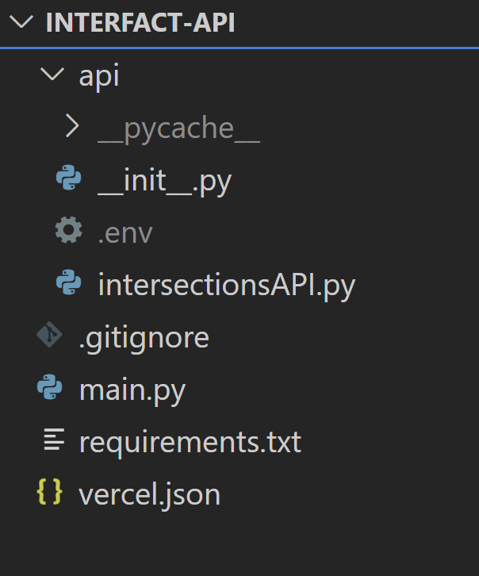

# Technology Stack: 

  • Internet connected camera hardware - Sends image data periodically to interfact.camera@gmail.com
  
  • StatusChecker Python program - Processes image data for presance of trains
  
  • SQL Database - Stores the status of the intersection & archives for future predictive features
  
  • Firebase - Stores the latest state for each intersection for system access
  
  • Angular - Front end development
  
  • ArcGIS - Plugin to overlay status on map

# Replicating Development Enviornment: 

## Code:
1. Download [Anaconda](https://www.anaconda.com/download/success) with python version 3.12
2. Install Anaconda; the default values are fine.
3. Open Anaconda Prompt
4. In prompt:
   * `conda create --name interfact python=3.13.0`
     * If you make something incorrectly, the command `conda remove -n [name] --all` will let you begin again
   *  type y to proceed
   * `conda activate interfact`
   * install packages using:
      * pip install Flask==3.0.3
      * pip install firebase-admin==6.5.0
      * pip install python-dotenv==1.0.1
      * pip install google-cloud-firestore==2.19.0
    * once done, type `pip list` to verify these are installed
5. In a terminal, clone the project with `git clone https://github.com/Ethan-Chester/Interfact-API.git`
6. Download VisualStudio Code, and install it per their instructions
7. Open VSCode and open the Interfact-API project
8. In the extensions tab on the left (looks like multiple blocks), download the Python
v2024.16.1 extension by Microsoft.
9. Return to the main tab, and press ctrl+shift+p (or cmd+shift+p for mac). In the tab select Python: Select Intrepreter. Then, select the Python 3.13.0 ('interfact') option.
10. In the api folder of the project, create a new file called `.env`
    * Inside the .env file write `firebase_api_key=''`
    * On another line, write `flask_secret_keys=''`
    * This is sensitive information that will be assigned to you later. 
11. Once you receive the keys, and the `.env` file is saved, you may run the API locally by running `main.py`.
    * Go to the link `http://127.0.0.1:5000/api/intersections/geo-json` to confirm that the build is producing geo-json properly.

# File & Folder Structure: 

  

This is the file structure for the Interfact API. init.py and intersection.py both constitute the API files, which are called in main.py.

In a seperate repository, a documentation file structure is implemented. Main runnable project files will be located in the Auxiliary Files folder, layout & design files are located in the Design folder, client meeting details are located in the Discovery folder, the Meeting Minutes folder contains team meeting dates and details, the Documentation folder contains the development and deployment files, and the Presentations folder contains files related to Interfact team presentations.
